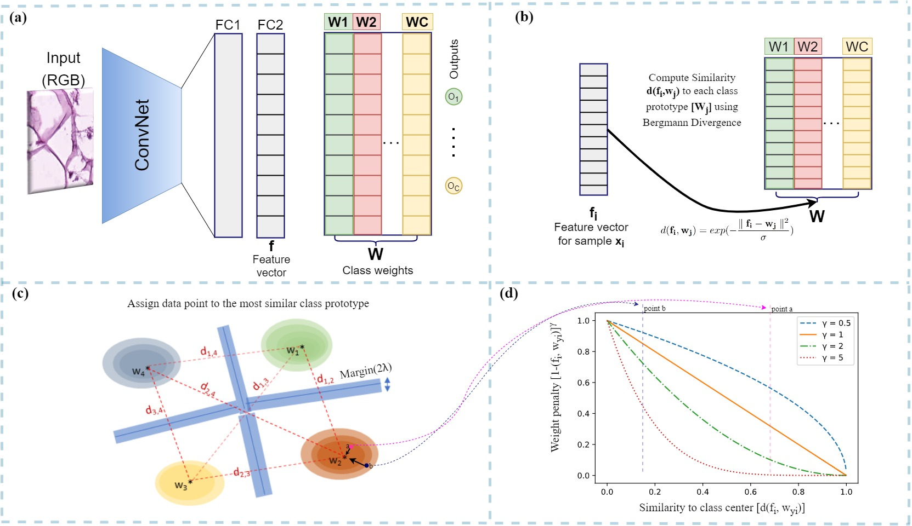

# CFAL-max-margin-keras
Implementation of CFAL, ArcFace, CosFace with generators in Keras

***Summary of Center-Focused Affinity Loss** Early-stage cancer diagnosis potentially improves the chances of survival for many cancer patients worldwide. 
Manual examination of Whole Slide Images (WSIs) is a time-consuming task for analyzing tumor-microenvironment.
To overcome this limitation, the conjunction of deep learning with computational pathology has been proposed to assist pathologists in efficiently prognosing the cancerous spread. Nevertheless, the existing deep learning methods are ill-equipped to handle fine-grained histopathology datasets. This is because these models are constrained via conventional softmax loss function, which cannot expose them to learn distinct representational embeddings of the similarly textured WSIs containing an imbalanced data distribution. To address this problem, we propose a novel center-focused affinity loss (CAFL) function that exhibits 1) constructing uniformly distributed class prototypes in the feature space, 2) penalizing difficult samples, 3) minimizing intra-class variations, and 4) placing greater emphasis on learning minority class features.*


##  CFAL System diagram 


An overview of the proposed framework. (a) During the training phase, the weights (W) representing class prototypes are learned, where C is the number of classes. The learned hidden features (FC2) in Euclidean space are similar to its class prototype, where similarity is measured using Eq.~\ref{deqn}. (b) The feature vector is assigned to an output class by using the similarity measure in eq.~\ref{deqn} instead of the vector dot product commonly used in softmax. (c) By using the center-focused affinity loss, we ensure intra-class compactness and inter-class separation of these class prototypes. Unlike the vanilla affinity loss, the margin penalty for misclassification of minor classes is more strict in comparison to the major classes. (d) The penalty term to promote intra-class compactness. A point is very similar to its class-prototype center if the similarity value is close to 1 (e.g., point a) and away from the center if it is close to 0 (e.g., point b).


## Requirements

- python == 3.9.13
- tensorflow-addons == 0.19.0
- tensorflow-gpu == 2.10.0
- keras == 2.10.0


## Reference
If you find our work useful in your research or if you use parts of this code please consider citing our [paper]():


```
@article{,
  title={Data-efficient and weakly supervised computational pathology on whole-slide images},
  author={},
  journal={},
  volume={},
  number={},
  pages={},
  year={},
  publisher={}
}
```
